# 项目实战流程

## 目录

- 实战目的：介绍整体项目实战的意义、目标

- 实战规则：介绍整体项目实战的角色划分、角色职能、工作规范制度

- 项目行业：介绍在线教育项目的行业背景

- 项目业务：介绍在线教育项目的业务流程：访问、咨询、线索、意向、报名、考勤

- 项目需求：介绍在线教育项目的需求、主题模块划分、指标及维度等内容

- 数据来源：介绍在线教育项目的数据来源及数据库地址，数据内容

- 技术架构：介绍在线教育项目的技术架构及技术选型

- 实施流程：讲解项目实战的大体实施流程：数仓设计、数据同步、数据处理、任务调度、报表构建

- 结果产出：讲解项目验收标准及产生物料

  

## 模块一：项目实战目的

- **学习问题**

  ```properties
  问题1: 项目学完了，感觉没有学到很多东西
  问题2: 上课的内容都听懂了，但是自己做不出来
  问题3: 项目的实现流程串不起来，不熟悉整体的流程和步骤
  问题4: 担心没有实际的项目经验，面试会紧张，找不到工作
  问题5: 没有做过项目，入职以后不能完成上级安排的任务
  ```

- **核心原因**

  - 没有参与需求，对==业务==不熟悉，不熟悉业务数据中的内容和关系
  - 没有参与设计，对==目标==不清晰，不理解最后需要的结果是什么
  - 没有参与开发，对项目不熟悉，不能梳理完整的==项目流程==和步骤

- **实战目的**

  ```properties
  a.加强代码开发能力: 自己动手参与开发SQL、脚本、调度
  b.熟悉项目开发流程: 参与需求分析、数仓设计、数据同步、数据处理、数据报表、任务调度
  c.增强团队协作能力: 多人配合完整多个模块，实现整个项目，产出项目结果
  ```

- 思想：既是实战，也是比赛，当做一场游戏或者剧本杀

- 目标：==更重过程==，学习到更综合内容，提升大家信心

  

## 模块二：项目实战规则

### 1、角色职责

- `产品经理：Product Manager`
  - 1.提出项目需求指标
  - 2.跟踪项目进度
  - 3.校验项目产出结果
- `项目经理：Project Manager`
  - 1.划分项目任务
  - 2.监督项目实施进度
  - 3.提供项目解决思路
  - 4.协调项目资源
- `项目组长：Team Leader`
  - 1.负责整个团队的组织管理
  - 2.负责组织组内的早晚例会
  - 3.负责协调分配每天每个组员的任务内容
  - 4.负责监督每个组员的完成进度，协助组内成员解决问题
  - 5.负责汇报组内的所有情况给PM
  - 6.负责及时完成自己的开发任务以及编写开发文档
- `项目成员：Data Engineer`
  - 1.负责参与项目设计
  - 2.按时上班，参加例会，发送日报
  - 3.按时完成组长分配的开发任务以及编写开发文档
  - 4.参与并完成项目答辩

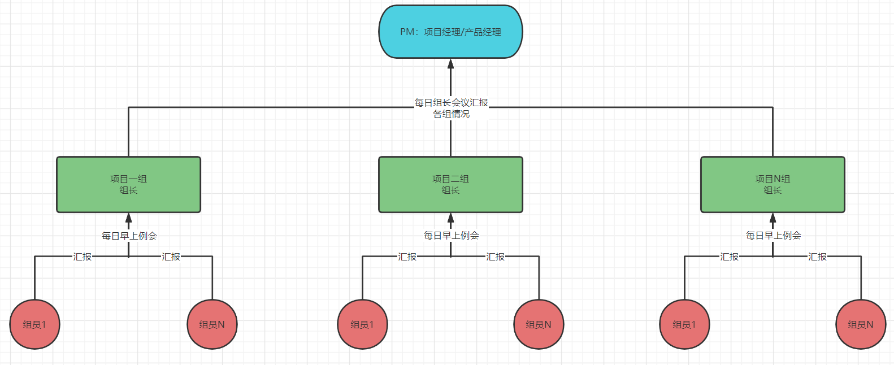


### 2、**每日流程**

- 时间明细表

  | 时间段【10月12日至10月17日】 |     流程     | 具体工作内容                                                 |
  | :--------------------------: | :----------: | ------------------------------------------------------------ |
  |        08:50 ~ 09:00         |     打卡     |                                                              |
  |       09:00  ~  09:30        |   早上例会   | 1、复盘昨日工作进度<br/>2、明确今日工作目标<br/>3、汇总昨日遇到问题<br/>4、记录考勤和会议记录【轮询记录】 |
  |       09:30  ~  12:00        |   项目实施   | 完成今日开发任务                                             |
  |       12:00  ~  14:30        | 午       休  | 淦饭                                                         |
  |       14:30  ~  18:30        |   项目实施   | 完成今日开发任务                                             |
  |       18:30  ~  19:30        | 晚        饭 | 淦饭                                                         |
  |       19:30  ~  19:45        |  晚 上例会   | 明确各成员进度以及反馈问题                                   |
  |       19:45  ~  21:00        |   项目实施   | 完成今日开发任务                                             |
  |       21:00  ~  自定义       |   今日总结   | 编写当日总结日报，并发送给Team Leader                        |

- 组员工作时间：打卡、早会、工作、午饭、工作、晚饭、晚会、强制自习【加班、复习】

- 组长工作时间：打卡、早会、项目会议、工作、午饭、工作、晚饭、晚会、强制自习【加班、复习】

  

### 3、**考勤制度**

- 原则：正常上班制度

- 每日09点，所有组员必须按时参加早上例会，不允许迟到早退

- 每日负责的任务，如果不能完成请自行加班

- 每日早上09点之前必须提交昨日的日报给组长

- 注意：讲师、班主任不定期巡查各组会议

  

### 4、团队分组

- **第1组**

  | 组长   | 组员                                                     |
  | ------ | -------------------------------------------------------- |
  | 段昌雷 | 张娇艳	苏玉茜	王杨杨	周梦召	彭仙桃	俞一文 |

- **第2组**

  | 组长   | 组员                                               |
  | ------ | -------------------------------------------------- |
  | 邰旭峰 | 刘东	傅骋汉	李跃辉	孙子涵	张宁	张努 |

- **第3组**

  | 组长   | 组员                                                   |
  | ------ | ------------------------------------------------------ |
  | 邹亦一 | 胡勇超	刘子涵	王勇	陈晓东	华海涛	符文政 |

- **第4组**

  | 组长   | 组员                                                 |
  | ------ | ---------------------------------------------------- |
  | 毛子阳 | 金向军	汪舟	繆勇	杨绪坤	邹小文	涂茂林 |

- **第5组**

  | 组长   | 组员                                                     |
  | ------ | -------------------------------------------------------- |
  | 范文卓 | 齐延培	李明康	岳梦雪	谢复灵	商理龙	张小康 |

- **第6组**

  | 组长   | 组员                                                   |
  | ------ | ------------------------------------------------------ |
  | 张庆杰 | 鲁自豪	詹仙红	张浩楠	周愉	王宇航	黄金泽 |

- **第7组**

  | 组长   | 组员                                                       |
  | ------ | ---------------------------------------------------------- |
  | 张鑫宇 | 陈志鹏	赵志成	陆易	朱猛	刘鑫涛	高翔	周豪 |

- **第8组**

  | 组长   | 组员                                                   |
  | ------ | ------------------------------------------------------ |
  | 刘宾宾 | 范鑫鑫	张昀	王海棠	王昕航	王一博	王松涛 |

- **第9组**

  | 组长   | 组员                                                     |
  | ------ | -------------------------------------------------------- |
  | 陈茂龙 | 王枝成	严重阳	陈叶翱	许子博	刘庆凯	薛绍国 |

- **第10组**

  | 组长   | 组员                                                 |
  | ------ | ---------------------------------------------------- |
  | 朱俊飞 | 林帅龙	王娟丽	李彬	王尧	孟祥宇	刘鹏飞 |

- ==每个组请给自己的组取一个响亮且高雅的名字==

  

## 模块三：项目行业背景

### 1、**行业**

- 在线教育平台：职业教育、K12、技能培训等

  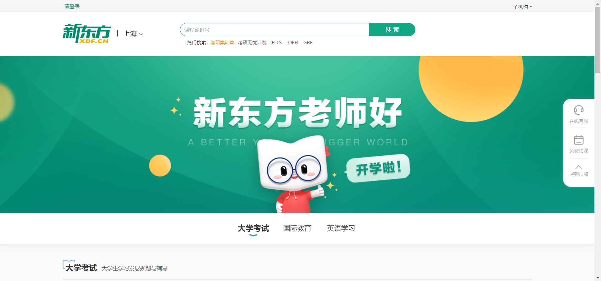

  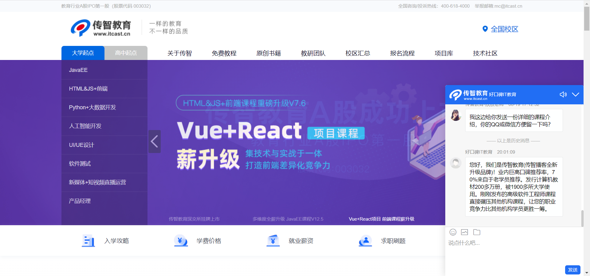

  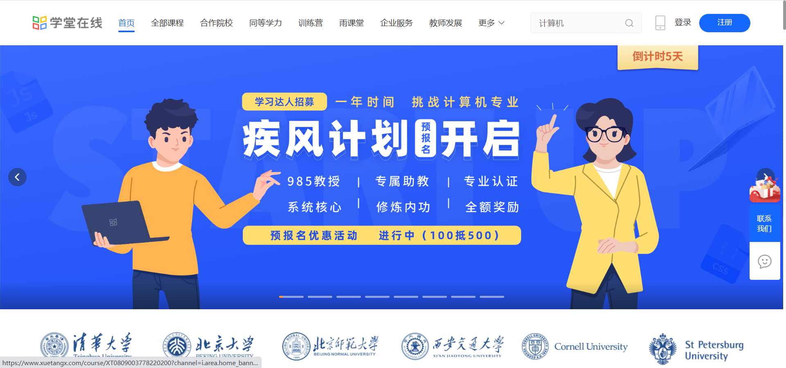


### 2、背景 

```
   在线教育公司的主要产品是课程，为了提高公司的课程销量、提升公司的口碑、帮助公司做更好的运营推广，该公司对公司的访问与咨询系统、客户服务系统、教学管理系统的数据进行了数据分析。通过分析用户的访问量、咨询量、意向量、报名量等指标计算用户从访问到报名阶段的报名率，反映公司的运营情况，支持运营决策。通过分析学员的出勤人数、迟到人数、请假人数等指标计算学员学习课程时的出勤率、迟到率等指标来监控学员的学习情况，进而实现学员的学习管理，保证学员的学习质量，提升公司口碑。
```

- 提升转化率：访问、咨询、意向、报名 => 提高报名转化率，挣更多的钱

- 提升学习质量：考勤、考试、就业分析 => 加强学员管理，提升口碑，可持续性挣钱

  

### 3、问题

```
    早期公司完成各项数据统计工作主要是基于web业务系统实现的, 通过SQL直接在业务数据库RDBMS中实施统计分析操作的,但是随着时间推移, 公司中数据量会越来越多, 此时原有的传统的数据库无法支撑庞大数据的存储, 需要解决数据存储的问题, 同时当数据量变大后, 原有的分析效率下降,不能及时的构建统计分析的结果，同时也造成大量的资源占用, 从而导致正常的数据支撑业务无法使用。
```

- 问题：之前都是基于MySQL数据库直接分析的，性能差，需求变多，数据变多，需要单独建立大数据平台

  

### 4、需求

- **基于之前的数据分析业务，构建大数据数据仓库平台，将原有的业务基于大数据数据仓库平台来实现**

  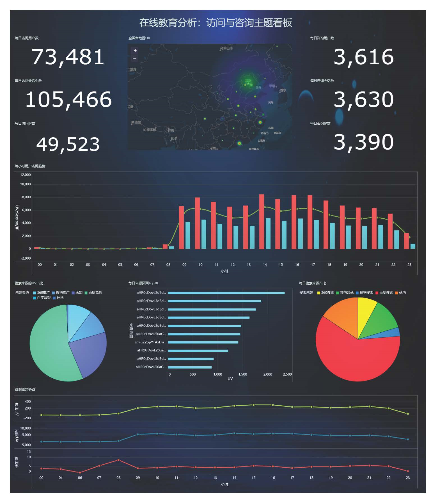

  

## 模块四：项目业务流程

### 1、**访问与咨询流程**

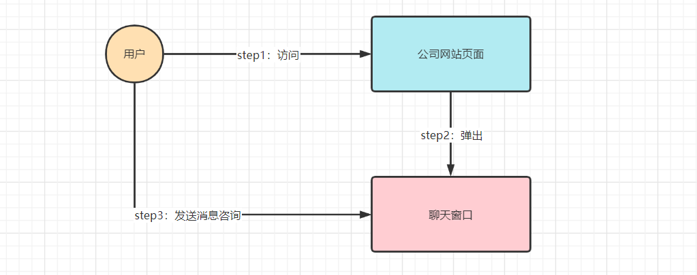

- step1：用户会进入公司网站页面进行访问
  
  - 访问用户
- step2：用户点击聊天窗口，发送咨询的消息
  
  - 咨询用户
- 访问用户和咨询用户的区别：是否发送了消息
  - 发送了消息就是咨询用户
  - 不论有没有发都是访问用户
  - 访问包含咨询的

- 统计访问人数：所有数据都参与统计

- 统计咨询人数：统计发送了消息的人数

  

### 2、**意向与线索流程**

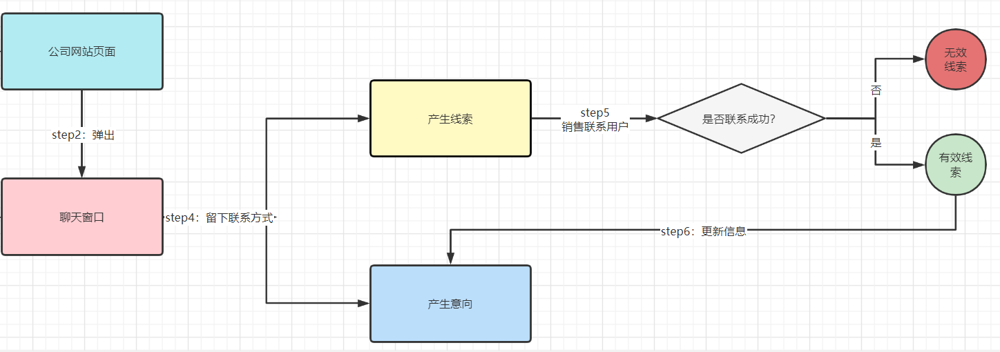

- step1：咨询时候会留下联系方式，会产生线索和意向数据

- step2

  - 后台会记录这个线索，销售会联系这个用户，

    - 如果联系不成功或者沟通失败，就是无效线索，需要申诉

    - 如果联系成功，就是一个有效线索
    - 是否为有效线索
  
- 后台会生成用户意向信息：记录销售、用户、意向报名课程、校区等信息
  
  - 意向用户
  
    

### 3、**报名流程**

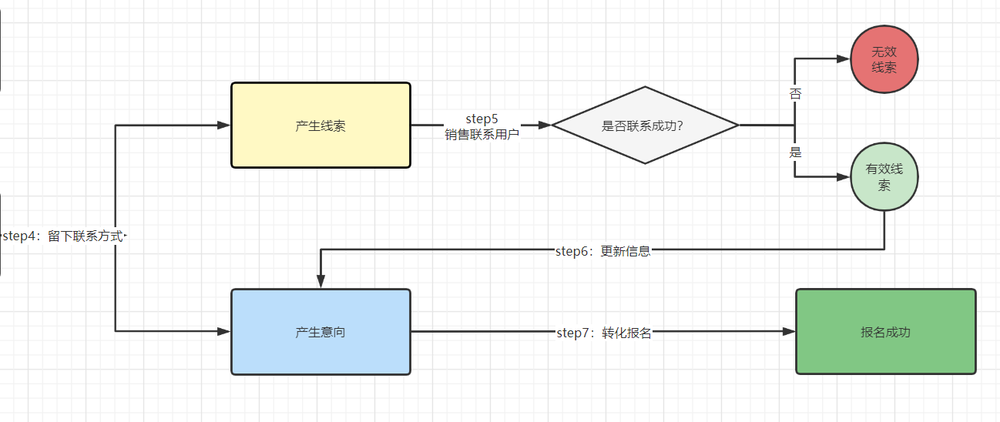

- step1：销售明确用户的意向以后，进行转化
- step2：用户接受转化，进行报名【支付】，成为了报名用户
- step3：在数据中更新用户报名的信息：支付时间、支付状态、报名班级等信息
- 意向的数据和报名的数据在同一张表，怎么知道这个用户是一个报名用户？
  - 支付状态：支付状态为PAID，就算报名了
- 意向的信息数据中包含了报名的数据


### 4、**考勤流程**

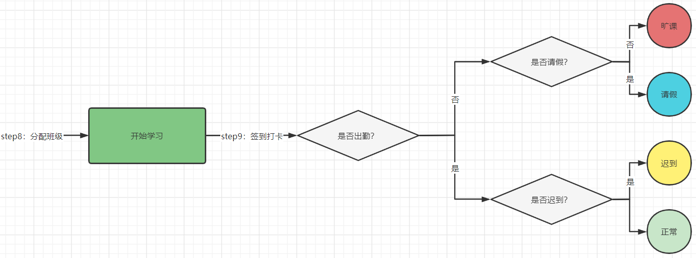

- step1：学员报名成功，开班进行上课学习
- step2：学员每天打卡签到，记录考勤的信息、请假信息、课程安排、作息时间
  - 考勤状态：出勤【正常、迟到】、请假、旷课


## 模块五：项目主题需求

### 1、**访问与咨询分析主题**：☆☆☆

- 每小时/每天/每月/每个季度/每年总访问用户量、总访问IP个数、总访问Session个数

- 每天/每月/每个季度/每年全国各个地区访问用户量、访问IP个数、访问Session个数

- 每天/每月/每个季度/每年每个来源渠道的访问用户量、访问IP个数、访问Session个数

- 每天/每月/每个季度/每年每个搜索来源的访问用户量、访问IP个数、访问Session个数

- 每天/每月/每个季度/每年每个来源页面的访问用户量、访问IP个数、访问Session个数

- 每天/每月/每个季度/每年全国各个地区咨询率：咨询率 = 咨询人数 / 访问人数

  

### 2、**意向与线索分析主题**：☆☆☆☆

- 每天/每月/每年线上线下以及新老学员的意向用户个数

- 每天/每月/每年各地区的线上线下以及新老学员的意向用户个数

- 每天/每月/每年各学科线上线下以及新老学员的意向用户个数Top10

- 每天/每月/每年各校区线上线下以及新老学员的意向用户个数Top10

- 每天/每月/每年各来源渠道线上线下以及新老学员的意向用户个数

- 每天/每月/每年各咨询中心线上线下以及新老学员的意向用户个数

- 每天线上线下及新老学员的有效线索个数

- 每小时线上线下及新老学员的有效线索转化率 = 有效线索个数 / 总线索个数

  

### 3、**报名分析主题**：☆☆☆

- 每天/每月/每年各个校区的报名人数

- 每天/每月/每年线上线下各个校区的报名人数

- 每天/每月/每年线上线下各个学科的报名人数

- 每天/每月/每年线上线下各个校区各个学科的报名人数

- 每天/每月/每年线上线下各个来源渠道的报名人数

- 每天/每月/每年线上线下各个咨询中心的报名人数

- 每天/每月/每年线上线下的意向转报名率 = 报名人数 / 意向人数

- 每天/每月/每年线上的有效线索报名转换率 = 报名人数 / 有效线索人数

  

### **4、考勤分析主题**：☆☆☆☆☆

- 每天每个班级各时间段的正常出勤人数、出勤率
  - 出勤人数：打卡时间在规定范围内的就算出勤用户的id个数
  - 出勤率：正常出勤人数 /  班级总人数
- 每天各个班级各时间段的迟到人数、迟到率
  - 迟到人数：打开时间在迟到范围内就算迟到打卡的用户的id个数
  - 迟到率 ： 迟到人数 / 总人数
- 每天各个班级各时间段的请假人数、请假率
  - 请假人数：请假的用户id个数
  - 请假率：请假人数 / 总人数
- 每天各个班级各时间段的旷课人数、旷课率
  - 旷课人数：总人数 - 出勤人数 - 迟到人数 - 请假人数
  - 旷课率：旷课人数 / 总人数


## 模块六：项目数据来源

### 6.1 **数据来源**

- 访问与咨询服务【客服系统】：存储所有用户访问和咨询的数据内容

- 客户服务系统【SCRM系统】：存储公司所有客户、校区、学科、班级、线索、员工、部门等数据

- 教学管理系统：存储所有学员的签到、请假、课程等信息

  

### 6.2 **业务库地址**

```properties
Mysql-OLAP: 106.75.33.59:3306
username: itcast_edu_stu
password: itcast_edu_stu
```

- nev：访问与咨询系统

- scrm：客户服务系统

- teach：教学管理系统

  

### 6.3 **访问与咨询服务系统**

- session_id：会话id，用于计算会话个数
- sid：用户id，用于计算用户个数
- ip：IP地址，用于计算IP个数
- msg_count：客户发送消息个数

#### a. **web_chat_ems_2019_07**：访问与咨询信息主表

| 字段名称                     | 字段解释               |
| ---------------------------- | ---------------------- |
| id                           | 主键                   |
| create_date_time             | 数据创建时间           |
| session_id                   | 七陌sessionId          |
| sid                          | 访客id                 |
| create_time                  | 会话创建时间           |
| seo_source                   | 搜索来源               |
| seo_keywords                 | 关键字                 |
| ip                           | IP地址                 |
| area                         | 地域                   |
| country                      | 所在国家               |
| province                     | 省                     |
| city                         | 城市                   |
| origin_channel               | 投放渠道【来源渠道】   |
| user                         | 所属坐席               |
| manual_time                  | 人工开始时间           |
| begin_time                   | 坐席领取时间           |
| end_time                     | 会话结束时间           |
| last_customer_msg_time_stamp | 客户最后一条消息的时间 |
| last_agent_msg_time_stamp    | 坐席最后一下回复的时间 |
| reply_msg_count              | 客服回复消息数         |
| msg_count                    | 客户发送消息数         |
| browser_name                 | 浏览器名称             |
| os_info                      | 系统名称               |


#### b. **web_chat_text_ems_2019_07**：访问与咨询信息副表

| 字段名称             | 字段解释       |
| -------------------- | -------------- |
| id                   | 主键           |
| referrer             | 上级来源页面   |
| from_url             | 会话来源页面   |
| landing_page_url     | 访客着陆页面   |
| url_title            | 咨询页面title  |
| platform_description | 客户平台信息   |
| other_params         | 扩展字段中数据 |
| history              | 历史访问记录   |


### 6.4 **SCRM：客户服务系统**

- 意向与线索主题
- 报名主题

#### a. **customer**：客户静态信息表

```
记录了所有学员的所有信息，主要提供地区维度
id：学员id
area：地区
```

| 字段名称                 | 字段注释           |
| ------------------------ | ------------------ |
| id                       | 学员id             |
| customer_relationship_id | 当前用户的意向id   |
| create_date_time         | 创建时间           |
| update_date_time         | 最后更新时间       |
| deleted                  | 是否被删除（禁用） |
| name                     | 姓名               |
| idcard                   | 身份证号           |
| birth_year               | 出生年份           |
| gender                   | 性别               |
| phone                    | 手机号             |
| wechat                   | 微信               |
| qq                       | qq号               |
| email                    | 邮箱               |
| area                     | 所在区域           |
| leave_school_date        | 离校时间           |
| graduation_date          | 毕业时间           |
| bxg_student_id           | 博学谷学员ID       |
| creator                  | 创建人ID           |
| origin_type              | 数据来源           |
| origin_channel           | 来源渠道           |
| tenant                   |                    |
| md_id                    | 中台id             |


#### b. customer_appeal：线索申诉信息表

```
辅助判断线索是否有效
customer_relationship_first_id:意向id
appeal_status:申诉状态
```

| 字段名称                       | 字段注释                          |
| ------------------------------ | --------------------------------- |
| id                             | 主键                              |
| customer_relationship_first_id | 第一条客户关系id                  |
| employee_id                    | 申诉人                            |
| employee_name                  | 申诉人姓名                        |
| employee_department_id         | 申诉人部门                        |
| employee_tdepart_id            | 申诉人所属部门                    |
| appeal_status                  | 申诉状态，0:待稽核 1:无效 2：有效 |
| audit_id                       | 稽核人id                          |
| audit_name                     | 稽核人姓名                        |
| audit_department_id            | 稽核人所在部门                    |
| audit_department_name          | 稽核人部门名称                    |
| audit_date_time                | 稽核时间                          |
| create_date_time               | 创建时间（申诉时间）              |
| update_date_time               | 更新时间                          |
| deleted                        | 删除标志位                        |
| tenant                         | 无                                |


#### c. **customer_clue**：客户线索表

```
线索分析：记录了每个意向的信息的线索信息，用于计算线索个数，提供新老学员维度，新线索就是新学员，老线索就是老学员
id:线索id
customer_relationship_id：意向id
clue_stat：VALID_NEW_CLUES是新线索
```

| 字段名称                 | 字段注释                                                     |
| ------------------------ | ------------------------------------------------------------ |
| id                       | 线索id                                                       |
| create_date_time         | 创建时间                                                     |
| update_date_time         | 最后更新时间                                                 |
| deleted                  | 是否被删除（禁用）                                           |
| customer_id              | 客户id                                                       |
| customer_relationship_id | 客户意向id                                                   |
| session_id               | 七陌会话id                                                   |
| sid                      | 访客id                                                       |
| status                   | 状态（undeal待领取 deal 已领取 finish 已关闭 changePeer 已流转） |
| user                     | 所属坐席                                                     |
| create_time              | 七陌创建时间                                                 |
| platform                 | 平台来源 （pc-网站咨询                                       |
| s_name                   | 用户名称                                                     |
| seo_source               | 搜索来源                                                     |
| seo_keywords             | 关键字                                                       |
| ip                       | IP地址                                                       |
| referrer                 | 上级来源页面                                                 |
| from_url                 | 会话来源页面                                                 |
| landing_page_url         | 访客着陆页面                                                 |
| url_title                | 咨询页面title                                                |
| to_peer                  | 所属技能组                                                   |
| manual_time              | 人工开始时间                                                 |
| begin_time               | 坐席领取时间                                                 |
| reply_msg_count          | 客服回复消息数                                               |
| total_msg_count          | 消息总数                                                     |
| msg_count                | 客户发送消息数                                               |
| comment                  | 备注                                                         |
| finish_reason            | 结束类型                                                     |
| finish_user              | 结束坐席                                                     |
| end_time                 | 会话结束时间                                                 |
| platform_description     | 客户平台信息                                                 |
| browser_name             | 浏览器名称                                                   |
| os_info                  | 系统名称                                                     |
| area                     | 区域                                                         |
| country                  | 所在国家                                                     |
| province                 | 省                                                           |
| city                     | 城市                                                         |
| creator                  | 创建人                                                       |
| name                     | 客户姓名                                                     |
| idcard                   | 身份证号                                                     |
| phone                    | 手机号                                                       |
| itcast_school_id         | 校区Id                                                       |
| itcast_school            | 校区名称                                                     |
| itcast_subject_id        | 学科Id                                                       |
| itcast_subject           | 学科名称                                                     |
| wechat                   | 微信                                                         |
| qq                       | qq号                                                         |
| email                    | 邮箱                                                         |
| gender                   | 性别                                                         |
| level                    | 客户级别                                                     |
| origin_type              | 数据来源渠道                                                 |
| information_way          | 资讯方式                                                     |
| working_years            | 开始工作时间                                                 |
| technical_directions     | 技术方向                                                     |
| customer_state           | 当前客户状态                                                 |
| valid                    | 该线索是否是网资有效线索                                     |
| anticipat_signup_date    | 预计报名时间                                                 |
| clue_state               | 线索状态  ：VALID_NEW_CLUES，代表新线索，是新学员            |
| scrm_department_id       | SCRM内部部门id                                               |
| superior_url             | 诸葛获取上级页面URL                                          |
| superior_source          | 诸葛获取上级页面URL标题                                      |
| landing_url              | 诸葛获取着陆页面URL                                          |
| landing_source           | 诸葛获取着陆页面URL来源                                      |
| info_url                 | 诸葛获取留咨页URL                                            |
| info_source              | 诸葛获取留咨页URL标题                                        |
| origin_channel           | 投放渠道                                                     |
| course_id                | 无                                                           |
| course_name              | 无                                                           |
| zhuge_session_id         | 无                                                           |
| is_repeat                | 是否重复线索(手机号维度) 0:正常 1：重复                      |
| tenant                   | 租户id                                                       |
| activity_id              | 活动id                                                       |
| activity_name            | 活动名称                                                     |
| follow_type              | 分配类型，0-自动分配，1-手动分配，2-自动转移，3-手动单个转移，4-手动批量转移，5-公海领取 |
| shunt_mode_id            | 匹配到的技能组id                                             |
| shunt_employee_group_id  | 所属分流员工组                                               |


#### d. **customer_relationship**：客户意向表

```
意向分析和报名分析：存储了所有意向和报名信息

id：意向id，唯一标记一条意向信息
create_date_time：创建日期
deleted：合法性判断的字段，如果为1，表示这一条意向信息已经被删除，不用参加统计
customer_id：用户id
orgin_type：线上线下，NETSERVICE or PRESIGNUP 表示线上，其他的值表示线下
itcast_school_id：校区id
itcast_subject_id：学科id
origin_channel：来源渠道
creator：负责这个意向信息的销售id
payment_state：支付状态
payment_time：支付时间
```

| 字段名称                    | 字段注释                                                     |
| --------------------------- | ------------------------------------------------------------ |
| id                          | 意向id                                                       |
| create_date_time            | 意向构建时间                                                 |
| update_date_time            | 最后更新时间                                                 |
| deleted                     | 是否被删除（禁用）                                           |
| customer_id                 | 所属客户id 【关联customer表中的id】                          |
| first_id                    | 第一条客户关系id                                             |
| belonger                    | 归属人                                                       |
| belonger_name               | 归属人姓名                                                   |
| initial_belonger            | 初始归属人                                                   |
| distribution_handler        | 分配处理人                                                   |
| business_scrm_department_id | 归属部门                                                     |
| last_visit_time             | 最后回访时间                                                 |
| next_visit_time             | 下次回访时间                                                 |
| origin_type                 | 数据来源 ，线上（NETSERVICE or PRESIGNUP）、线下             |
| itcast_school_id            | 意向校区Id                                                   |
| itcast_subject_id           | 意向学科Id                                                   |
| intention_study_type        | 意向学习方式                                                 |
| anticipat_signup_date       | 预计报名时间                                                 |
| level                       | 客户级别                                                     |
| creator                     | 创建人                                                       |
| current_creator             | 当前创建人：初始创建人，当在公海拉回时为拉回人               |
| creator_name                | 创建者姓名                                                   |
| origin_channel              | 来源渠道                                                     |
| comment                     | 备注                                                         |
| first_customer_clue_id      | 第一条线索id                                                 |
| last_customer_clue_id       | 最后一条线索id                                               |
| process_state               | 处理状态                                                     |
| process_time                | 处理状态变动时间                                             |
| payment_state               | 支付状态                                                     |
| payment_time                | 支付状态变动时间                                             |
| signup_state                | 报名状态                                                     |
| signup_time                 | 报名时间                                                     |
| notice_state                | 通知状态                                                     |
| notice_time                 | 通知状态变动时间                                             |
| lock_state                  | 锁定状态                                                     |
| lock_time                   | 锁定状态修改时间                                             |
| itcast_clazz_id             | 所属ems班级id                                                |
| itcast_clazz_time           | 报班时间                                                     |
| payment_url                 | 付款链接                                                     |
| payment_url_time            | 支付链接生成时间                                             |
| ems_student_id              | ems的学生id                                                  |
| delete_reason               | 删除原因                                                     |
| deleter                     | 删除人                                                       |
| deleter_name                | 删除人姓名                                                   |
| delete_time                 | 删除时间                                                     |
| course_id                   | 课程ID                                                       |
| course_name                 | 课程名称                                                     |
| delete_comment              | 删除原因说明                                                 |
| close_state                 | 关闭装填                                                     |
| close_time                  | 关闭状态变动时间                                             |
| appeal_id                   | 申诉id                                                       |
| tenant                      | 租户                                                         |
| total_fee                   | 报名费总金额                                                 |
| belonged                    | 小周期归属人                                                 |
| belonged_time               | 归属时间                                                     |
| belonger_time               | 归属时间                                                     |
| transfer                    | 转移人                                                       |
| transfer_time               | 转移时间                                                     |
| follow_type                 | 分配类型:0-自动分配，1-手动分配，2-自动转移，3-手动单个转移，4-手动批量转移，5-公海领取 |
| transfer_bxg_oa_account     | 转移到博学谷归属人OA账号                                     |
| transfer_bxg_belonger_name  | 转移到博学谷归属人OA姓名                                     |


#### e. **employee**：员工信息表

```
记录每个员工的信息：为了关联得到部门维度
id：员工id
tdepart_id：销售部门id
```

| 字段名称            | 字段注释               |
| ------------------- | ---------------------- |
| id                  | 员工id                 |
| email               | 公司邮箱，OA登录账号   |
| real_name           | 员工的真实姓名         |
| phone               | 手机号，目前还没有     |
| department_id       | OA中的部门编号，有负值 |
| department_name     | OA中的部门名           |
| remote_login        | 员工是否可以远程登录   |
| job_number          | 员工工号               |
| cross_school        | 是否有跨校区权限       |
| last_login_date     | 最后登录日期           |
| creator             | 创建人                 |
| create_date_time    | 创建时间               |
| update_date_time    | 最后更新时间           |
| deleted             | 是否被删除（禁用）     |
| scrm_department_id  | SCRM内部部门id         |
| leave_office        | 离职状态               |
| leave_office_time   | 离职时间               |
| reinstated_time     | 复职时间               |
| superior_leaders_id | 上级领导ID             |
| tdepart_id          | 直属部门               |
| tenant              |                        |
| ems_user_name       |                        |


#### f. **itcast_clazz**：班级信息表

```
用于报名分析：线索分析和意向分析用不到，提供学科和校区维度

id：班级id
itcast_school_id：校区id
itcast_school_name：校区名称
itcast_subject_id：学科id
itcast_subject_name：学科名称
```

| 字段名称            | 字段注释           |
| ------------------- | ------------------ |
| id                  | 班级id(非自增)     |
| create_date_time    | 创建时间           |
| update_date_time    | 最后更新时间       |
| deleted             | 是否被删除（禁用） |
| itcast_school_id    | 校区ID             |
| itcast_school_name  | 校区名称           |
| itcast_subject_id   | 学科ID             |
| itcast_subject_name | 学科名称           |
| itcast_brand        | 品牌               |
| clazz_type_state    | 班级类型状态       |
| clazz_type_name     | 班级类型名称       |
| teaching_mode       | 授课模式           |
| start_time          | 开班时间           |
| end_time            | 毕业时间           |
| comment             | 备注               |
| detail              | 详情(比如：27期)   |
| uncertain           | 待定班(0:否,1:是)  |
| tenant              | 无                 |


#### g. **itcast_school**：校区信息表

```
意向分析

id: 校区id
name：校区名称
```

| 字段名称         | 字段注释           |
| ---------------- | ------------------ |
| id               | 校区id             |
| create_date_time | 创建时间           |
| update_date_time | 最后更新时间       |
| deleted          | 是否被删除（禁用） |
| name             | 校区名称           |
| code             | 无                 |
| tenant           | 无                 |


#### h. **itcast_subject**：学科信息表

```
意向分析

id：学科id
name：学科名称
```

| 字段名称         | 字段注释           |
| ---------------- | ------------------ |
| id               | 学科id             |
| create_date_time | 创建时间           |
| update_date_time | 最后更新时间       |
| deleted          | 是否被删除（禁用） |
| name             | 学科名称           |
| code             | 无                 |
| tenant           | 无                 |


#### i. **scrm_department**：员工部门表

```
意向分析、报名分析

记录了整个公司所有销售部门信息
id：部门id
name：部门名称
```

| 字段名称         | 字段注释               |
| ---------------- | ---------------------- |
| id               | 部门id                 |
| name             | 部门名称               |
| parent_id        | 父部门id               |
| create_date_time | 创建时间               |
| update_date_time | 更新时间               |
| deleted          | 删除标志               |
| id_path          | 编码全路径             |
| tdepart_code     | 直属部门               |
| creator          | 创建者                 |
| depart_level     | 部门层级               |
| depart_sign      | 部门标志，暂时默认1    |
| depart_line      | 业务线，存储业务线编码 |
| depart_sort      | 排序字段               |
| disable_flag     | 禁用标志               |
| tenant           | 无                     |


- 赠送意向分析逻辑关联图：意向分析

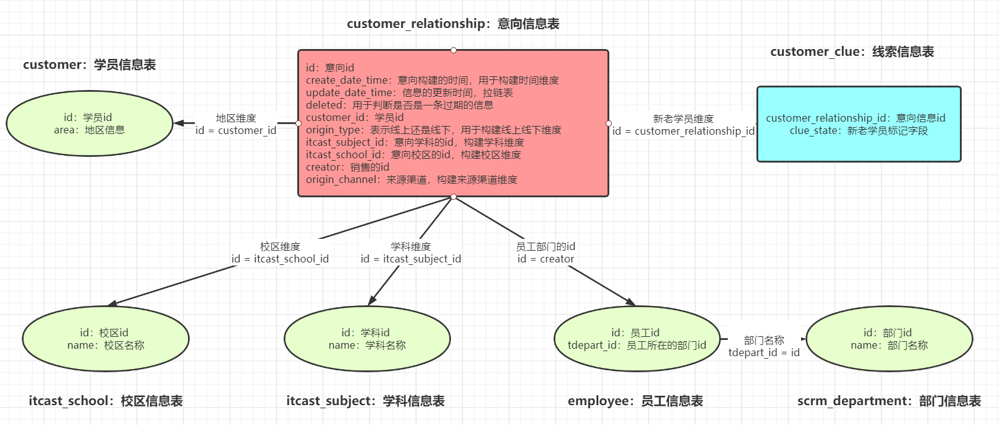

- 赠送报名分析逻辑关联图

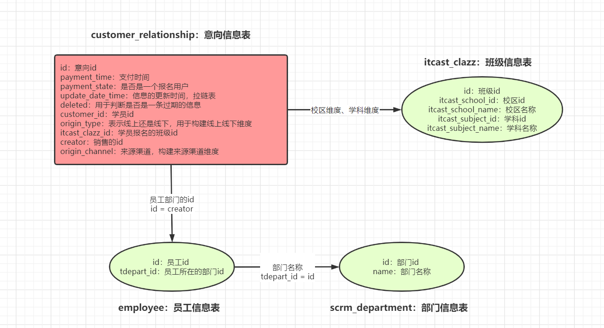


### 6.5 **教学管理系统**

#### 1. tbh_student_signin_record：学生打卡信息表

```
作用：出勤、迟到统计分析

time_table_id：用于关联作息时间的，判断是否为一个有效的打卡
class_id：哪个班级
student_id：哪个学员
signin_time：打卡时间
signin_date：打卡日期
share_state：共屏开放状态
```

| 字段名称          | 字段注释                                                     |
| ----------------- | ------------------------------------------------------------ |
| id                | 主键id                                                       |
| normal_class_flag | 是否正课 1 正课 2 自习                                       |
| time_table_id     | 作息时间id 关联 tbh_school_time_table 或者 tbh_class_time_table |
| class_id          | 班级id                                                       |
| student_id        | 学员id                                                       |
| signin_time       | 签到时间                                                     |
| signin_date       | 签到日期                                                     |
| inner_flag        | 内外网标志  0 外网 1 内网                                    |
| signin_type       | 签到类型 1 心跳打卡 2 老师补卡                               |
| share_state       | 共享屏幕状态 0 否 1是，在上午或下午段有共屏记录，则该段所有记录该字段为1，内网默认为1 外网默认为0 |
| inner_ip          | 内网ip地址                                                   |


#### 2. tbh_class_time_table：班级作息时间表

```
作用：用于关联打卡表或者请假表，判断是否合法

id：作息时间id
morning_begin_time：上午上课时间
morning_end_time：上午下课时间
afternoon_begin_time：下午开始时间
afternoon_end_time：下午结束时间
evening_begin_time：晚上开始时间
evening_end_time：晚上结束时间
```

| 字段名称              | 字段注释       |
| --------------------- | -------------- |
| id                    | 主键id         |
| class_id              | 班级id         |
| morning_template_id   | 上午出勤模板id |
| morning_begin_time    | 上午开始时间   |
| morning_end_time      | 上午结束时间   |
| afternoon_template_id | 下午出勤模板id |
| afternoon_begin_time  | 下午开始时间   |
| afternoon_end_time    | 下午结束时间   |
| evening_template_id   | 晚上出勤模板id |
| evening_begin_time    | 晚上开始时间   |
| evening_end_time      | 晚上结束时间   |
| use_begin_date        | 使用开始日期   |
| use_end_date          | 使用结束日期   |
| create_time           | 创建时间       |
| create_person         | 创建人         |
| remark                | 备注           |


#### 3.  course_table_upload_detail：班级排课信息表

```
作用：判定打卡或者请假合法性

class_id：班级id
class_date：班级上课日期
content：上课内容【null代表休息，或者是开班典礼 =》 无效打卡或者无效请假】
```

| 字段名称            | 字段注释                                         |
| ------------------- | ------------------------------------------------ |
| id                  | id                                               |
| base_id             | 课程主表id                                       |
| class_id            | 班级id                                           |
| class_date          | 上课日期                                         |
| content             | 课程内容                                         |
| teacher_id          | 老师id                                           |
| teacher_name        | 老师名字                                         |
| job_number          | 工号                                             |
| classroom_id        | 教室id                                           |
| classroom_name      | 教室名称                                         |
| is_outline          | 是否大纲 0 否 1 是                               |
| class_mode          | 上课模式 0 传统全天 1 AB上午 2 AB下午 3 线上直播 |
| is_stage_exam       | 是否阶段考试（0：否 1：是）                      |
| is_pay              | 代课费（0：无 1：有）                            |
| tutor_teacher_id    | 晚自习辅导老师id                                 |
| tutor_teacher_name  | 辅导老师姓名                                     |
| tutor_job_number    | 晚自习辅导老师工号                               |
| is_subsidy          | 晚自习补贴（0：无 1：有）                        |
| answer_teacher_id   | 答疑老师id                                       |
| answer_teacher_name | 答疑老师姓名                                     |
| answer_job_number   | 答疑老师工号                                     |
| remark              | 备注                                             |
| create_time         | 创建时间                                         |


#### 4. class_studying_student_count：在读学员人数信息表

```
作用：计算出勤率、迟到率、请假率、旷课人数

classId：班级id
studying_student_count：班级总人数
```

| 字段名称               | 字段注释     |
| ---------------------- | ------------ |
| id                     |              |
| school_id              | 校区id       |
| subject_id             | 学科id       |
| class_id               | 班级id       |
| studying_student_count | 在读班级人数 |
| studying_date          | 在读日期     |


#### 5. student_leave_apply：学生请假申请表

```
作用：计算请假人数

class_id：哪个班级
student_id：哪个学生
audit_state：是否被批准
begin_time：请假开始时间
end_time：请假结束时间
create_time：提交请假日期
```


| 字段名称        | 字段注释                                   |
| --------------- | ------------------------------------------ |
| id              | 序列id                                     |
| class_id        | 班级id                                     |
| student_id      | 学员id                                     |
| audit_state     | 审核状态 0 待审核 1 通过 2 不通过          |
| audit_person    | 审核人                                     |
| audit_time      | 审核时间                                   |
| audit_remark    | 审核备注                                   |
| leave_type      | 请假类型  1 请假 2 销假                    |
| leave_reason    | 请假原因  1 事假 2 病假                    |
| begin_time      | 请假开始时间                               |
| begin_time_type | 1：上午 2：下午                            |
| end_time        | 请假结束时间                               |
| end_time_type   | 1：上午 2：下午                            |
| days            | 请假/已休天数                              |
| cancel_state    | 撤销状态  0 未撤销 1 已撤销                |
| cancel_time     | 撤销时间                                   |
| old_leave_id    | 原请假id，只有leave_type =2 销假的时候才有 |
| leave_remark    | 请假/销假说明                              |
| valid_state     | 是否有效（0：无效 1：有效）                |
| create_time     | 创建时间                                   |

- 赠送考勤数据关联关系图


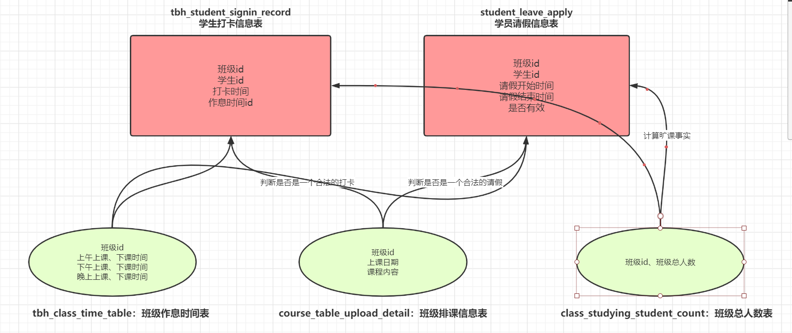


## 模块七：项目技术架构

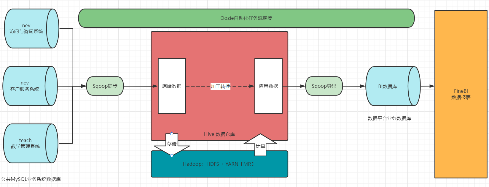


- 实现环境：基于新零售的虚拟机来实现，建库建表等等
- 数据来源：MySQL【云服务器】
- 数据同步：Sqoop
- 数据存储：Hive
- 数据计算：Hive、presto
- 数据导出：Sqoop、presto
- 数据应用：MySQL【自己的Hadoop01】 + FineBI
- 数据调度：Oozie


## 模块八：项目实施流程

### 1、**需求分析**

- **目标**：分析公司==业务流程==环节，熟悉业务数据表==内容及关系==，明确主题分析的==维度及指标==
- **内容**
  - 业务数据表：记录表名、表名解释、数据内容、字段信息、业务库建表语句
  - 关联关系图：梳理所有数据表的关联关系，构建所有表的关联关系图
  - 指标及维度：梳理主题中需要的指标、指标的计算方式、维度以及设计到的数据内容
- **产出**：==**《XXXX主题分析需求文档.md》**==


### 2、**建模实现**

- **目标**：设计整个数据仓库的==分层及每一层的数据表==有哪些
- **内容**
  - 建模设计：按照需求划分事实表和维度表，事实数据表有哪些、维度数据表有哪些
  - 分层明细：描述整个项目的数仓分层的设计，分哪些层次，每一层的功能是什么等
  - 设计明细：根据需求以及每一层的功能，描述每一层有哪些表以及每张表的信息
- **产出**：**《XXXX主题建模设计文档.md》**


### 3、数据同步

- **目标**：实现将业务数据库数据同步到Hive的ODS数据表中
- **内容**
  - sqoop程序：开发Sqoop程序实现对不同数据的==全量或者增量同步==
  - Shell脚本：将sqoop程序封装在Shell脚本中
- **产出**：数据同步脚本：Shell
- 注意：不限制脚本个数


### 4、**数据清洗**

- **目标**：实现对原始数据的数据清洗，包括==非法数据的过滤，转换、补全==等操作

- **内容**

  - HiveSQL：使用SQL语句对ODS层数据进行数据清洗保存到DWD层
  - Shell脚本：将HiveSQL封装在Shell脚本中

- **产出**：数据清洗脚本：Shell+SQL

- 注意：不限制脚本个数

  

### 5、数据分析

- **目标**：实现对数据清洗后的数据按照需求进行对应主题的加工处理分析
- **内容**
  - HiveSQL、PrestoSQL：使用SQL对每个主题每一层的数据进行==转换处理，加工得到应用层==结果
  - Shell脚本：将HiveSQL封装在Shell脚本中
- **产出**：数据分析脚本：Shell+SQL
- 注意：不限制脚本个数


### 6、数据导出

- **目标**：将Hive应用层的数据使用Sqoop同步导出到MySQL中，用于构建报表
- **内容**
  - sqoop程序：开发Sqoop程序实现将Hive数据导出到MySQL
  - Shell脚本：将sqoop程序封装在Shell脚本中
- **产出**：数据导出脚本：Shell


### 7、**调度脚本**

- **目标**：将整个主题中所有脚本进行调试，封装成任务流调度脚本，实现任务流调度
- **内容**
  - 调度脚本：列举需要调度的所有Shell脚本及SQL文件的内容
  - 任务流调度：使用Oozie实现构建任务流以及运行任务流
- **产出**：《XXXX主题任务流调度交付文档.md》


### 8、**数据报表**

- **目标**：对需要做报表的主题，利用FineBI构建报表
- **内容**
  - 主题报表：按照需求构建主题分析报表
- **产出**：《XXXX主题数据报表交付文档.md》


## 模块九：项目最终产出

### 1、每组最终产出物料

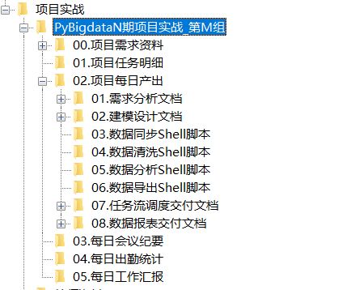

- **01.项目任务明细**

  - 组长每日记录组员完成进度情况

- **02.每日开发产出**
  
  - 需求分析文档
  - 建模设计文档
  - 数据同步脚本
  - 数据清洗脚本
  - 数据分析脚本
  - 数据导出脚本
  - 任务调度文档
  - 数据报表文档
  
- **03.每日会议纪要**

  - 每组成员每天轮流做会议纪要：做完会议纪要，由该同学**==直接推送Gitee仓库==**【==每天轮流做==】

- **04.每日工作汇报**

  - 所有同学每日都要发送日报给组长，组长保留所有日报
  
  

### 2、答辩评分规则事宜

- **整体思想**：既是实战，也是比赛。既重结果，更重过程。

- **答辩流程**

  - 环节一：提交产出材料：答辩前一天的24点之前，需要各组长以小组为单位提交项目产出资料到老师企业微信
  - 环节二：演示开发结果：答辩时每组需要展示每个主题的最终结果，并根据老师要求运行指定主题的任务流调度程序。
    - 每个主题单独构建一个任务流
  - 环节三：面试答辩考核：根据老师的提问回答项目设计及实施细节。

- **评分标准**

  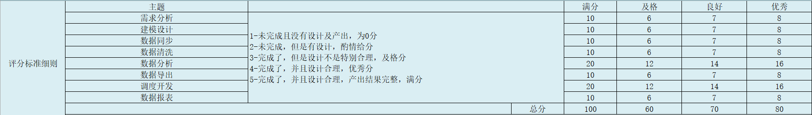

  

## 模块十：今日产出

### 1、创建小组实战群

- 请各位组长今晚创建各组的项目实战群，并拉入小组成员、讲师、班主任、就业老师
- 群名：`PyBigdata04_第N组_项目小组名称`
- 注意：每位同学改好自己的备注


### 2、举行项目设计讨论会

- a. ==确定团队小组称号==：每个团队给自己取一个积极向上且合法响亮的称号
  - 参考：大数据独立团、中国梦支队、我的团长我的团、天线宝宝、数码宝贝、叮咚买菜团等
- b. 完成项目整体分工：任务明细中已有默认划分情况，==可以组内各自自行协调调整各自的任务==
  - 参考：《项目任务明细》
- c. ==**讨论项目分层设计**==：确定项目整体的设计方案，最终确定项目分层设计
  - 将分层结果发给我：ODS、DWD、DWB/DWM、DWS、ADS

### 3、创建Gitee远程仓库

- 组长创建仓库
- 设置为公开状态
- 邀请自己组员作为开发者到仓库中

### 4、今日问题

1、能不能给个提示那些表需要构建拉链表？

- 项目中可以不考虑拉链表，只要数据同步时体现数据新增及更新即可
- 主要都是第一次运行：所有数据都会同步

2、增量同步也可以不考虑吧？

- 考虑：全量覆盖、新增同步、新增及更新同步
- sqoop的命令不一样

3、主题内的任务，有些有先后顺序，那等同学A做完同学B再做是不是有点耽误？

- 自己商量，尽量两个同学都做一部分内容
- 负责开发，负责写文档，每个人写文档不同的部分，一个些代码，一个测试
- 数据同步：每个人同步不同的表
- 数据清洗：每个人清洗不同的表
- 数据分析：每个分析不同维度下的不同指标


