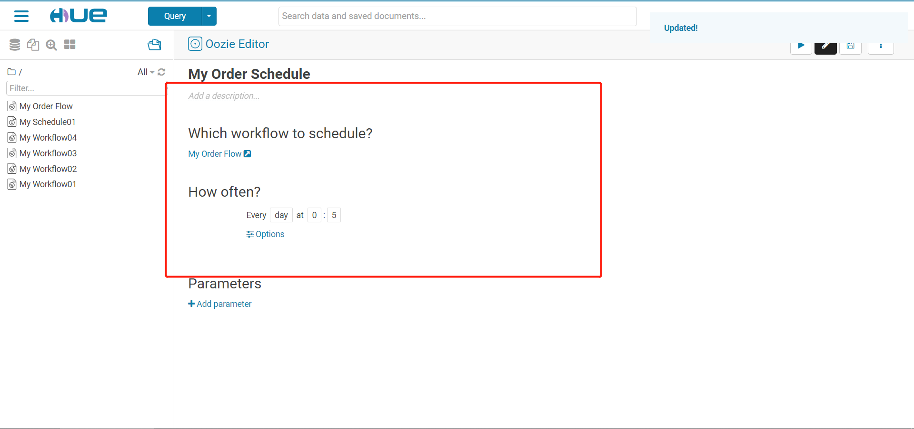

#                      XXXX主题任务流调度交付文档


## 1、脚本文件

- 主要内容：列举需要调度的所有Shell脚本及SQL文件的内容

- **==示例如下==**

  - 01.collect.sh

    ```shell
    #!/bin/bash
    
    #step1：先获取要采集的数据时间，规则：如果没有给参数，就默认处理昨天的日期，如果给了参数，就参数对应的日期
    if [ $# -ne 0 ]
    then
    	#参数个数不为0
    	if [ $# -ne 1 ]
    	then
    		echo "参数至多只能有一个，为处理的日期，请重新运行！"
    		exit 100
    	else
    		#参数个数只有1个，就用第一个参数作为处理的日期
    		yesterday=$1
    	fi
    else
    	#参数个数为0，默认处理昨天的日期
    	yesterday=`date -d '-1 day' +%Y-%m-%d`
    fi
    echo "step1：要处理的日期是：${yesterday}"
    
    echo "step2：开始运行采集的程序"
    #step2：运行增量采集
    sqoop  import \
    --connect jdbc:mysql://hadoop01:3306/db_order \
    --username root \
    --password-file hdfs://hadoop01:8020/user/oozie/shell/sqoop.passwd \
    --query "select * from tb_order where substring(create_time,1,10) = '${yesterday}' and \$CONDITIONS " \
    --delete-target-dir \
    --target-dir /nginx/logs/tb_order/daystr=${yesterday} \
    --fields-terminated-by '\t' \
    -m 1
    
    echo "step2：采集的程序运行结束"
    
    
    echo "step3：开始运行ETL"
    #模拟ETL的过程，将采集的新增的数据移动到表的目录下
    #先判断结果是否存在，如果已经存在，先删除再移动
    hdfs dfs -test -e  /user/hive/warehouse/tb_order/daystr=${yesterday}
    if [ $? -eq 0 ]
    then
    	#存在
    	hdfs dfs -rm -r  /user/hive/warehouse/tb_order/daystr=${yesterday}
    	hdfs dfs -cp /nginx/logs/tb_order/daystr=${yesterday} /user/hive/warehouse/tb_order/
    else
    	#不存在
    	hdfs dfs -cp /nginx/logs/tb_order/daystr=${yesterday} /user/hive/warehouse/tb_order/
    fi 
    echo "step3：ETL结束"
    ```

  - 02.analysis.sh

    ```shell
    #!/bin/bash
    
    #step1：先获取要采集的数据时间，规则：如果没有给参数，就默认处理昨天的日期，如果给了参数，就参数对应的日期
    if [ $# -ne 0 ]
    then
    #参数个数不为0
    if [ $# -ne 1 ]
    then
    	echo "参数至多只能有一个，为处理的日期，请重新运行！"
    	exit 100
    else
    	#参数个数只有1个，就用第一个参数作为处理的日期
    	yesterday=$1
    fi
    else
    #参数个数为0，默认处理昨天的日期
    yesterday=`date -d '-1 day' +%Y-%m-%d`
    fi
    echo "step1：要处理的日期是：${yesterday}"
    
    echo "step2：开始运行分析"
    #step2：运行分析程序
    hive --hiveconf yest=${yesterday}  -f  hdfs://hadoop01:8020/user/oozie/shell/02.analysis.sql
    
    echo "step2：分析的程序运行结束"
    ```

  - 02.analysis.sql

    ```sql
    create table if not exists default.tb_order(
      id string ,
      pid string,
      userid string,
      price double ,
      create_time string
    )
    partitioned  by (daystr string)
    row format delimited fields terminated by '\t'
    location '/user/hive/warehouse/tb_order';
    
    alter table default.tb_order add if not exists partition (daystr='${hiveconf:yest}');
    
    
    create table if not exists default.tb_order_num_rs(
      daystr string,
      order_number int
    )
    row format delimited fields terminated by '\t';
    
    insert into table default.tb_order_num_rs
    select
      daystr,
      count(id) as order_number
    from default.tb_order
    where daystr='${hiveconf:yest}'
    group by daystr;
    ```

    

## 2、任务流调度

- 主要内容：展示构建的任务流以及运行的结果

- **==示例如下==**

  

  

  

